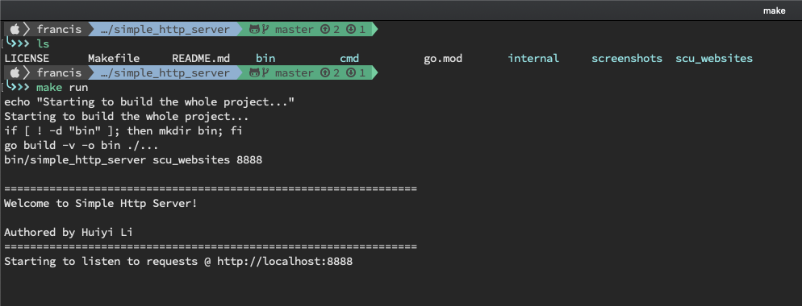
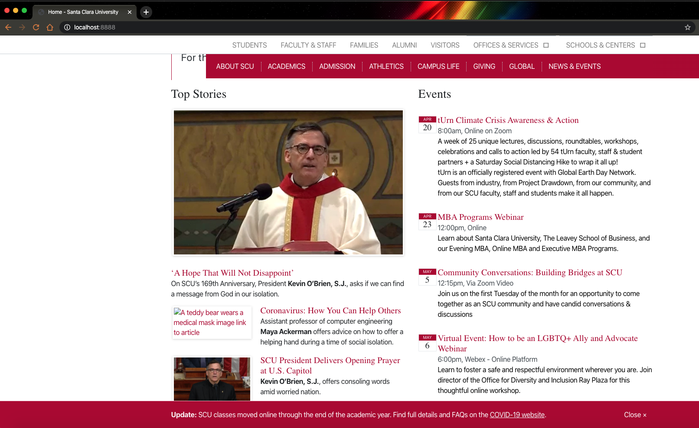
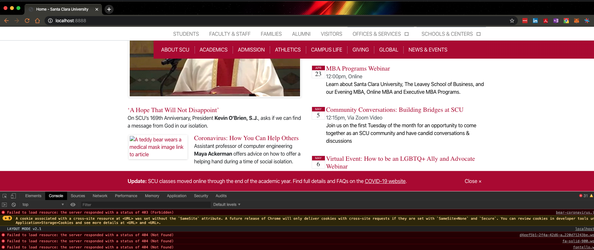

# simple_http_server
A simple http server written in Go which supports some parts of the HTTP/1.1 protocol

[View me on github!](https://github.com/0x00101010/simple_http_server)

## What do we support

* persistent connections from HTTP/1.1
* serving files with extensions *.jpg, *.html, *.txt, *.jpg, *.gif
* Some of HTTP Status Code (200, 404, 403, 400)
* Configuring document root and port

## Details with screenshots
* This is a screenshot of how to run the program.


* This is a screenshot of successful result (with some icons/images not shown as intended, see below point for explanation)


* correct handling of HTTP status codes, as you could see from below picture, we've correctly handled status codes of 200, 403, 404, etc.


* Event driven (Utilizing the same connection for multiple requests) & multithreading, [internal/server/server.go](../blob/master/internal/server/server.go)
```go
// ListenAndServe starts the http listener and start accepting incoming
// http requests
func (s *Server) ListenAndServe() {
	for {
		conn, err := s.conns.TryAcceptNewConn(s.listener)
		if err == connpool.ErrFullCapacity {
			time.Sleep(2 * time.Second)
		} else {
			time.Sleep(100 * time.Millisecond)
		}

		// one minute live time for persistent connections
		conn.SetDeadline(time.Now().Add(60 * time.Second))

        // handle every connection with a different go thread
		go s.HandleRequest(conn)
	}
}
```

* Close connection after every request, since we're doing active connections, we don't close connection after request, we close them when they're no longer used after 1 minute. [internal/server/server.go](../blob/master/internal/server/server.go)

```go
// one minute live time for persistent connections
conn.SetDeadline(time.Now().Add(60 * time.Second))
```


## Environment
* go version 1.13+

## How to build the project
Go to project root directory, run below command:
```
make build
```

## How to test
After building the project, please run the following command to start the server, and then try to type localhost:`port` in your browser.
```
make test
```

## One command execution
You could also try using the below command for both building and testing the project. I've commited the web resources under `scu_websites` folder
```
make run
```

## Author
Huiyi (Francis) Li

hli2@scu.edu

